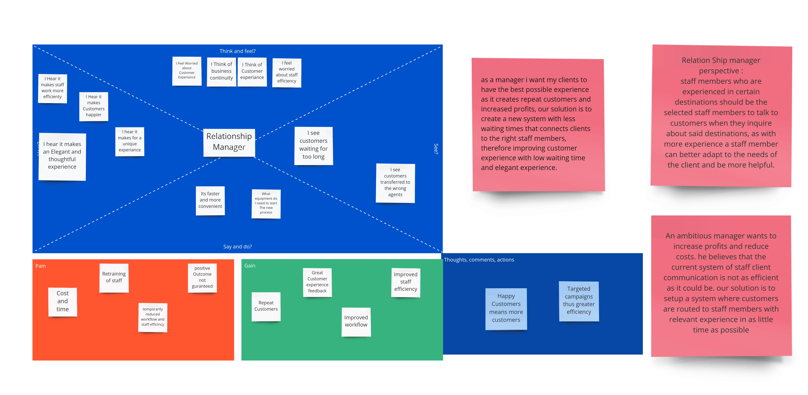
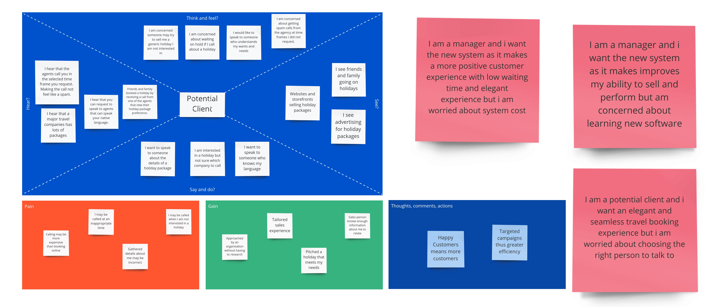
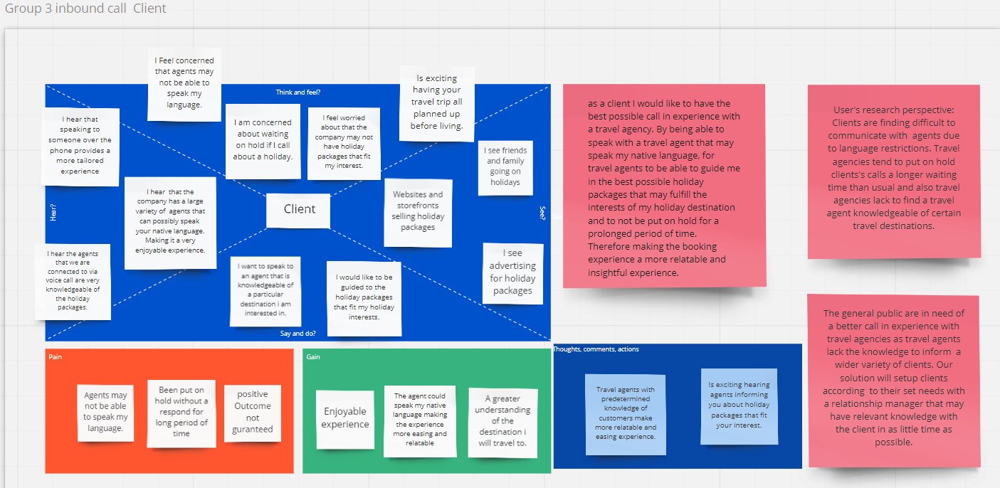
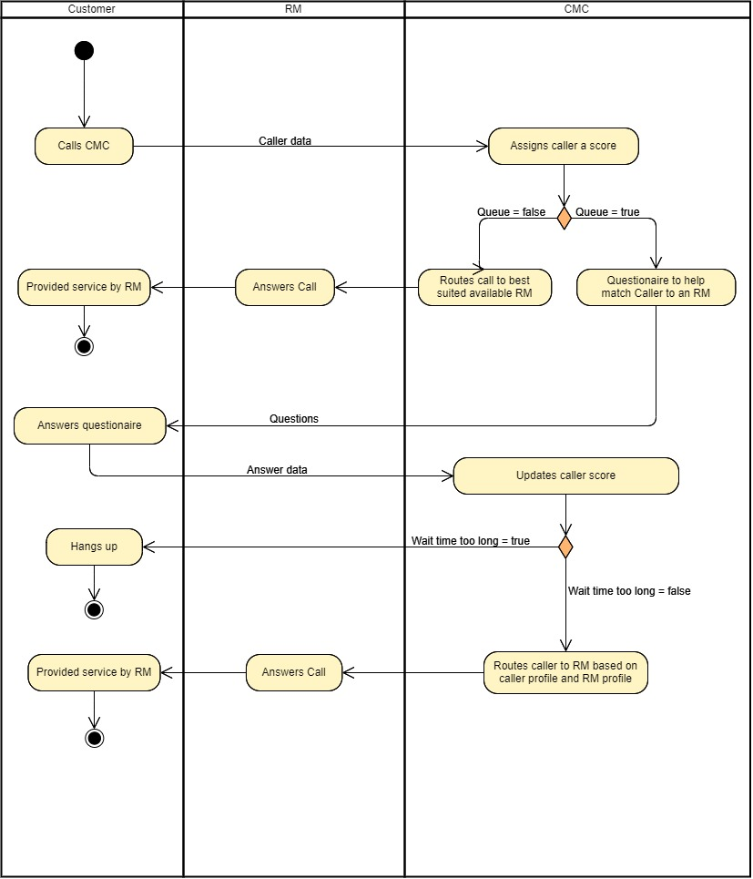

# Major Travel Company CMC

## Objectives

## Stakeholders
* Travel company
* Employees of travel company
* Customers of travel company
* In-house Call Management Centre (CMC)
* Relationship Managers (RM)
* Accommodators of holidays planned by the travel company (hotels, cruises, tours, airlines etc.)
* Telco Provider
* Direct financial beneficiaries of the travel company (shareholders/owners)
* Travel company recruiters
* Travel company database management team
* Travel company IT support
* Owners of commercial real estate used for travel company offices
* Travel company database hosting service
* Travel company competitors
* Travel company website management team

## Empathy Maps
### Relationship Manager

### Outbound Client

### Inbound Client

>>>>>>> f061bb51690e2e8a15c39931ca8e4e880ee15ce0

## User Stories
### Assumptions
### User Stories
#### Relationship Manager Profiles

As a relationship manager I want to profile my skills and attributes digitally so that I can be directed to the most effective customers and packages

As an outbound customer I want to speak to a relationship manager who is knowledgeable about the product I am interested in so that I can gain information I require

As an outbound customer I want to speak to a relationship manager who I can relate with so that I can more easily communicate my needs and wants 

#### Outbound Call
As an outbound customer I want to be contacted directly at a time that is convenient to me so that I am not interrupted

As an outbound customer I want to remove myself from the call list so that I can stop receiving calls if I am not interested

#### Inbound Call
As an inbound caller I want to provide basic details about my enquiry so that I can clarify my intentions

#### Calls
As a relationship manager I want calls to be made automatically so that I can increase my call and sale performance

As a relationship manager I want to see detailed information regarding the customer as I call so that I can tailor the sales experience

As a customer I want to wait for the shortest possible time so that I am less inclined to hang up

As a relationship manager I want a script that I can quote while calling so that I can optimise the likelihood of a sale

As a relationship manager I want a list of products that the customer may be interested in so that I can provide them with options they are likely to purchase

As a relationship manager I want see a score that represents how likely a customer is to buy something so that I can tailor my sales pitch

<<<<<<< HEAD
#### Call Holding
As a customer I want to wait for the shortest possible time so that I am less inclined to hang up

As a relationship manager I want waiting calls automatically forwarded to me so that I am likely to receive relevant calls to my skill set

## Questionare
### RM
1.) How many Languages can you speak and whats your fluency in each language, 1 being poorly familiar and 10 being extreamly fluent?

Replies could include:
                        * I am able to speak two languages fairly fluently english and spanish, english with a rating of 7/10 and spanish with a rating of 10/10,
                          Thus making me an excellent consultant for people of spanish backgrounds or individuals wanting to visit any spanish speaking country.
        
2.) How many countries have you visited and what sort of traveller were you?

Replies could include:
                        * I have been to 3 countries in total australia, spain, france providing me with excellent knowledge to these countries, france being the 
                        one visited as a student tourist on a low budget, thus i got to experiance the true life style of a student traveler and a budget orianted
                        tourist providing me the ability to empathies with such travelers.
                        
3.) how do you time manage and plane your activities?

Replies could include:
                        * Travel consultants require excellent time managment skills and as such i have built a strict habbit of planing all my activities ahead 
                        of time and following such plans, i use apps like MS Calander in order to not only manage my future activities but also to manage my daily
                        and hourly tasks.

4.) Are you a peoples person? and are you confident at speaking?

Replies could include:
                        * Having conducted many presentations in the forms of public speaking to a diverese audiance of diffrent age groups, genderes backgrounds
                        and intrests i belive it has caused me to develop an extreame confidence when speaking with people and easily understand there needs.
                        
5.) How strong are your computer skills?

Replies could include:
                        * as someone who utilises the internet for all my career needs, ranging from conducting research to blog writing to general browsing 
                        and as someone who uses a suit of apps to manage time and task flows i belive i have a strong knowledge when it comes to technology.

6.) Why do you want to enter the travel industry?

Replies could include:
                        * Having always wanted to travel the world i find my self taking an intrest towards countries causing me to continuesly read and research
                        about the worlds diffrent countries and the experiances of a traveler, thus giving me a strong passion towards travel and helping people 
                        choose the right experiance.

7.) How strong are your geagraphy skills?

Replies could include:
                        * As i have taken several geagraphy releated subjects at university and recived a distinction average in most of these subjects i belive 
                        i have excellent knowledge when it comes to geography.
                        
### Client
1.) Which countries have you traveled?

Replies could include:
                        * I have been to a total of two countries Britan and australia. Britan being the visited country as a tourist, in which i visited 
                        many destinations around london.
                        
2.) What Did you enjoy most in your travels?

Replies could include:
                        * Meeting new people in london and experiancing this new culture and seeing its many similarities and diffrences to the australian
                        culture.
                        
3.) what sites did you visit in your destinations?

Replies could include:
                        * I visited numerous historical attractions and museuims.
                        
4.) what budget have you previously allocated to your trvels and what budget are you allocating now? 

Replies could include:
                        * I have not allocated a strict budget for my previous travel and was flexible with my spending, i ended up spending somewhere in the range of 5K
                        and i am planing to roughly spend the same amount this time.
                        
5.) what type of experiance do you wish to enjoy during this travel

Replies could include:
                        * I wish to view more historical sites and experiance a more diverse culture.
                        
## Use case Narratives
Use Case Narrative 2

Use Case Name: Repeating customer makes an inbound call

## Activity Diagrams
### Inbound Calls

>>>>>>> f061bb51690e2e8a15c39931ca8e4e880ee15ce0
