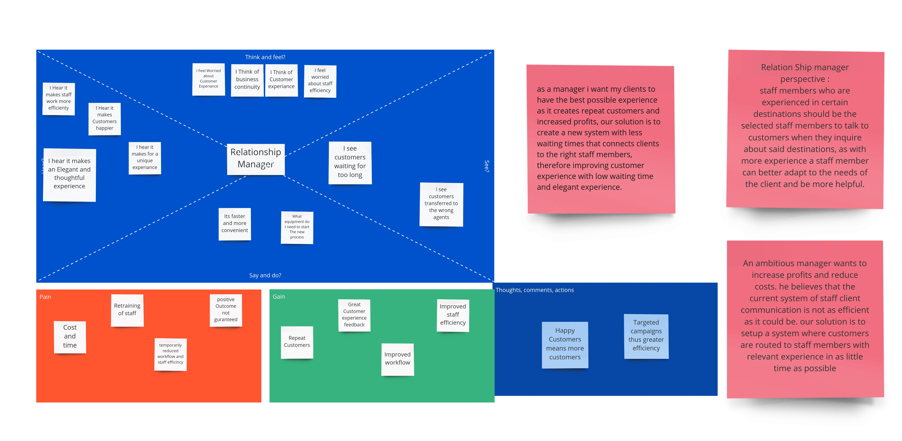
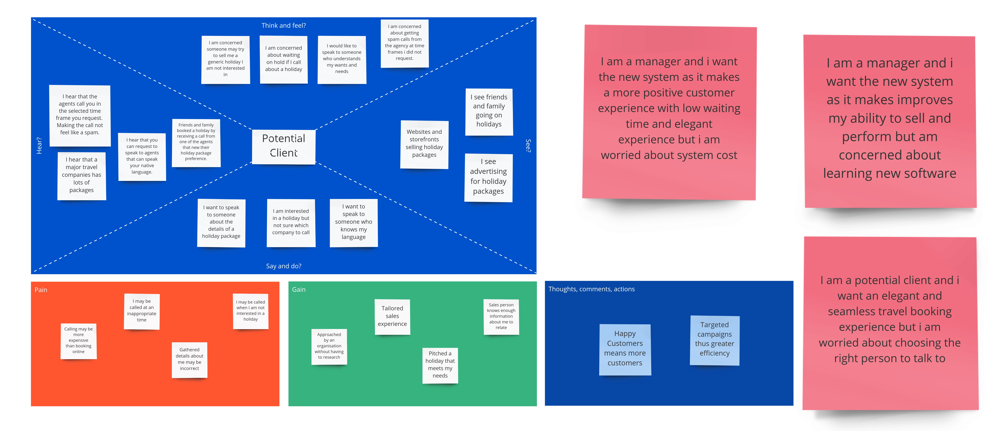
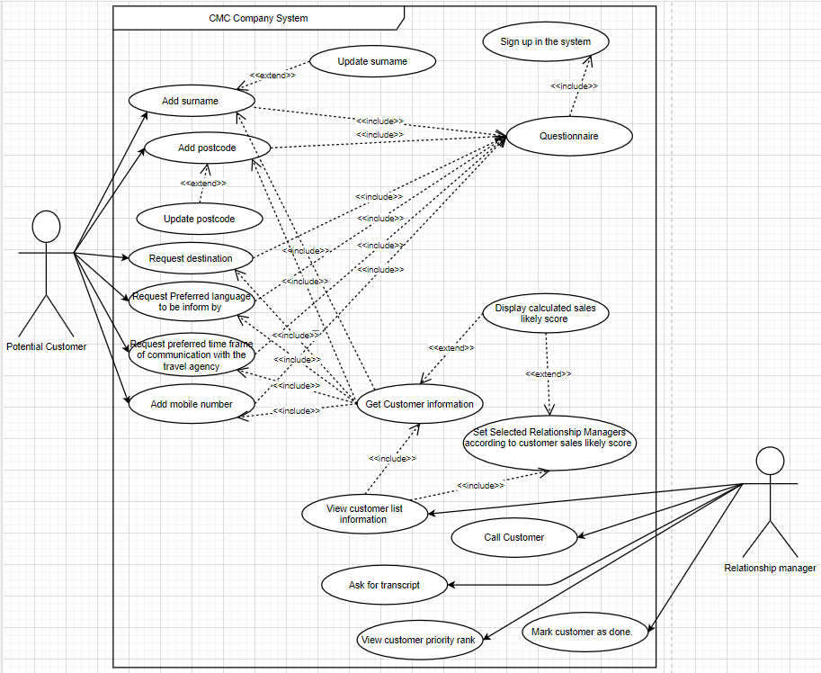
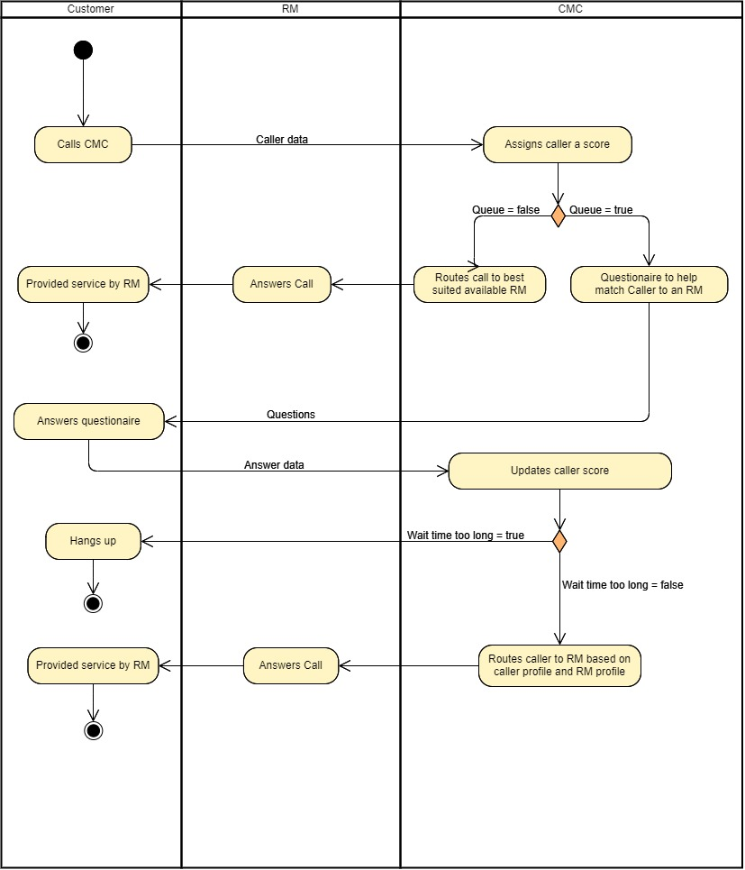
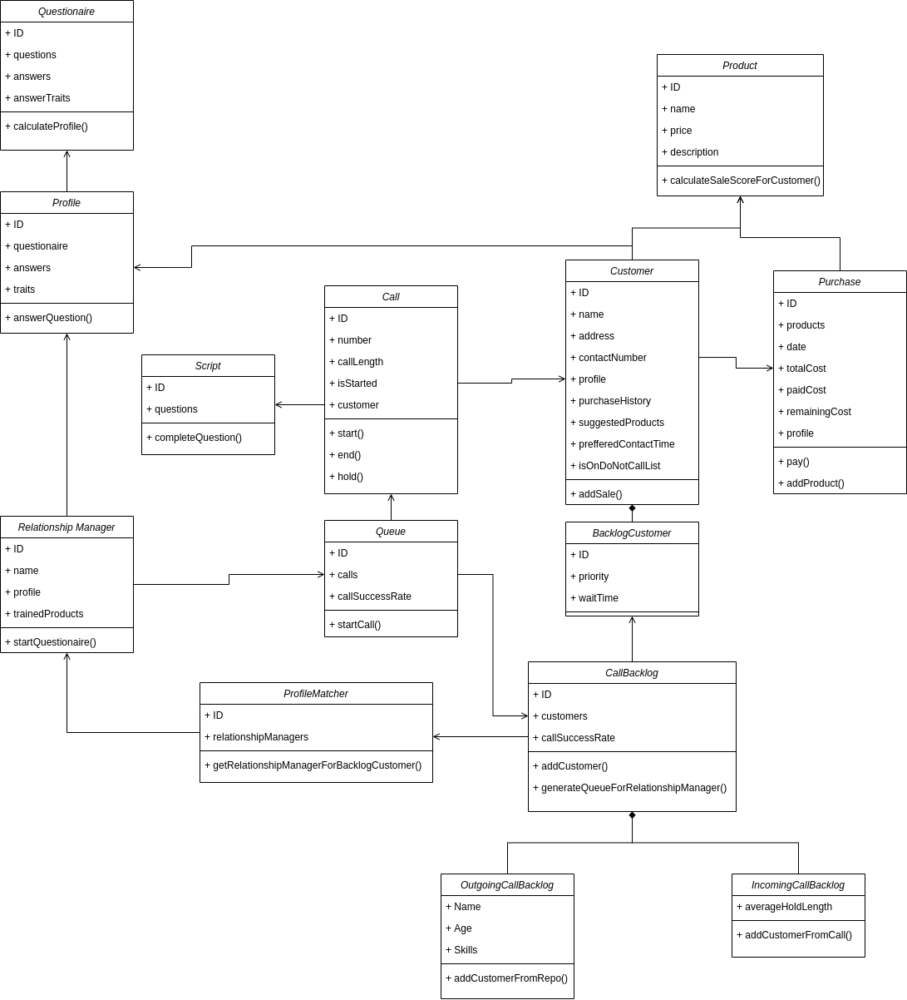
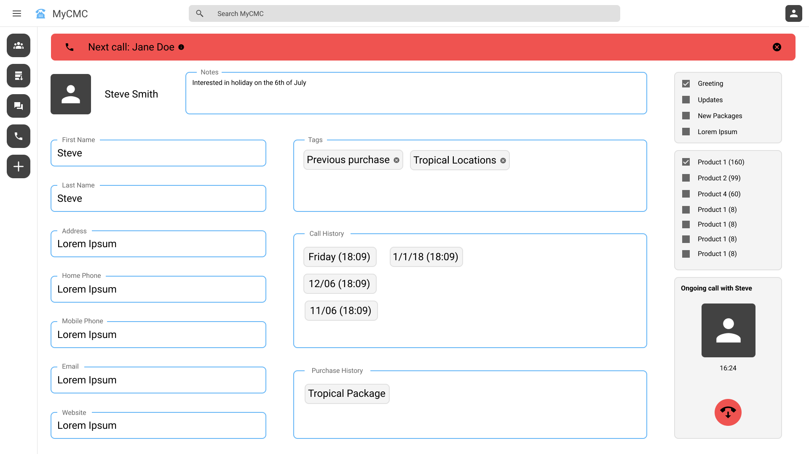
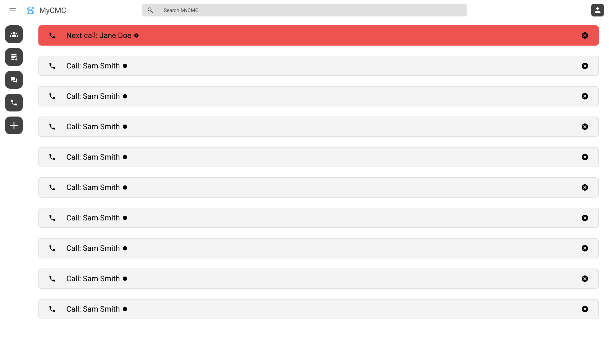

# Major Travel Company CMC

## Objectives

## Stakeholders
* Travel company
* Employees of travel company
* Customers of travel company
* In-house Call Management Centre (CMC)
* Relationship Managers (RM)
* Accommodators of holidays planned by the travel company (hotels, cruises, tours, airlines etc.)
* Telco Provider
* Direct financial beneficiaries of the travel company (shareholders/owners)
* Travel company recruiters
* Travel company database management team
* Travel company IT support
* Owners of commercial real estate used for travel company offices
* Travel company database hosting service
* Travel company competitors
* Travel company website management team

## Empathy Maps
### Relationship Manager

### Outbound Client

### Inbound Client

## User Stories
### Assumptions
### User Stories
#### Relationship Manager Profiles

As a relationship manager I want to profile my skills and attributes digitally so that I can be directed to the most effective customers and packages

As an outbound customer I want to speak to a relationship manager who is knowledgeable about the product I am interested in so that I can gain information I require

As an outbound customer I want to speak to a relationship manager who I can relate with so that I can more easily communicate my needs and wants 

#### Outbound Call
As an outbound customer I want to be contacted directly at a time that is convenient to me so that I am not interrupted

As an outbound customer I want to remove myself from the call list so that I can stop receiving calls if I am not interested

#### Inbound Call
As an inbound caller I want to provide basic details about my enquiry so that I can clarify my intentions

As a repeat customer with recent sales history I want to be prioritised when making an inbound call so that I am more likely to make a purchase.

#### Calls
As a relationship manager I want calls to be made automatically so that I can increase my call and sale performance

As a relationship manager I want to see detailed information regarding the customer as I call so that I can tailor the sales experience

As a customer I want to wait for the shortest possible time so that I am less inclined to hang up

As a relationship manager I want a script that I can quote while calling so that I can optimise the likelihood of a sale

As a relationship manager I want a list of products that the customer may be interested in so that I can provide them with options they are likely to purchase

As a relationship manager I want see a score that represents how likely a customer is to buy something so that I can tailor my sales pitch

## Questionnaire
### RM
1. How many Languages can you speak and whats your fluency in each language, 1 being poorly familiar and 10 being extreamly fluent?

    Replies could include:
    * I am able to speak two languages fairly fluently english and spanish, english with a rating of 7/10 and spanish with a rating of 10/10,
    Thus making me an excellent consultant for people of spanish backgrounds or individuals wanting to visit any spanish speaking country.

2. How many countries have you visited and what sort of traveller were you?

    Replies could include:
    * I have been to 3 countries in total australia, spain, france providing me with excellent knowledge to these countries, france being the 
    one visited as a student tourist on a low budget, thus i got to experiance the true life style of a student traveler and a budget orianted
    tourist providing me the ability to empathies with such travelers.

3. how do you time manage and plane your activities?

    Replies could include:
    * Travel consultants require excellent time managment skills and as such i have built a strict habbit of planing all my activities ahead 
    of time and following such plans, i use apps like MS Calander in order to not only manage my future activities but also to manage my daily
    and hourly tasks.

4. Are you a peoples person? and are you confident at speaking?

    Replies could include:
    * Having conducted many presentations in the forms of public speaking to a diverese audiance of diffrent age groups, genderes backgrounds
    and intrests i belive it has caused me to develop an extreame confidence when speaking with people and easily understand there needs.

5. How strong are your computer skills?

    Replies could include:
    * as someone who utilises the internet for all my career needs, ranging from conducting research to blog writing to general browsing 
    and as someone who uses a suit of apps to manage time and task flows i belive i have a strong knowledge when it comes to technology.

6. Why do you want to enter the travel industry?

    Replies could include:
    * Having always wanted to travel the world i find my self taking an intrest towards countries causing me to continuesly read and research
    about the worlds diffrent countries and the experiances of a traveler, thus giving me a strong passion towards travel and helping people 
    choose the right experiance.

7. How strong are your geagraphy skills?

    Replies could include:
    * As i have taken several geagraphy releated subjects at university and recived a distinction average in most of these subjects i belive 
    i have excellent knowledge when it comes to geography.
                        
### Client
1. Which countries have you traveled?

    Replies could include:
    * I have been to a total of two countries Britan and australia. Britan being the visited country as a tourist, in which i visited 
    many destinations around london.

2. What Did you enjoy most in your travels?

    Replies could include:
    * Meeting new people in london and experiancing this new culture and seeing its many similarities and diffrences to the australian
    culture.

3. what sites did you visit in your destinations?

    Replies could include:
    * I visited numerous historical attractions and museuims.

4. what budget have you previously allocated to your trvels and what budget are you allocating now? 

    Replies could include:
    * I have not allocated a strict budget for my previous travel and was flexible with my spending, i ended up spending somewhere in the range of 5K
    and i am planing to roughly spend the same amount this time.

5. what type of experiance do you wish to enjoy during this travel

    Replies could include:
    * I wish to view more historical sites and experiance a more diverse culture.
                        
## Use case Narratives

### Use Case Narrative 1

Use Case Name: Relationship manager; Potential customer selection for an outbound call

| Use Case ID                    | UC101: Relationship Manager Profiles                                                                                                                                                                                                                                                                                                                                                                                                                                                                                                                                                                                                                                                                                                                                                                                                                                                                                                                                                                                                                                                                                                                                                                                                                                                                                                         |
|--------------------------------|----------------------------------------------------------------------------------------------------------------------------------------------------------------------------------------------------------------------------------------------------------------------------------------------------------------------------------------------------------------------------------------------------------------------------------------------------------------------------------------------------------------------------------------------------------------------------------------------------------------------------------------------------------------------------------------------------------------------------------------------------------------------------------------------------------------------------------------------------------------------------------------------------------------------------------------------------------------------------------------------------------------------------------------------------------------------------------------------------------------------------------------------------------------------------------------------------------------------------------------------------------------------------------------------------------------------------------------------|
| User Story                     | As a relationship manager I want to profile my skills and attributes digitally so that I can be directed to the most effective customers and packages                                                                                                                                                                                                                                                                                                                                                                                                                                                                                                                                                                                                                                                                                                                                                                                                                                                                                                                                                                                                                                                                                                                                                                                        |
| Goal                           | For the relationship manager to be directed to an outbound call with a customer that will most likely buy a holiday package                                                                                                                                                                                                                                                                                                                                                                                                                                                                                                                                                                                                                                                                                                                                                                                                                                                                                                                                                                                                                                                                                                                                                                                                                  |
| Priority                       | H                                                                                                                                                                                                                                                                                                                                                                                                                                                                                                                                                                                                                                                                                                                                                                                                                                                                                                                                                                                                                                                                                                                                                                                                                                                                                                                                            |
| Actors                         | Primary Actor — Relationship Manager Secondary Actor — Potential customer                                                                                                                                                                                                                                                                                                                                                                                                                                                                                                                                                                                                                                                                                                                                                                                                                                                                                                                                                                                                                                                                                                                                                                                                                                                                 |
| Pre-conditions                 | The potential customer has access to the Online CMC Company system.   The Relationship manager profile is uploaded in the database of the CMC system                                                                                                                                                                                                                                                                                                                                                                                                                                                                                                                                                                                                                                                                                                                                                                                                                                                                                                                                                                                                                                                                                                                                                                                |
| Post-conditions                | he Relationship manager calls the customer with the highest sales likely score                                                                                                                                                                                                                                                                                                                                                                                                                                                                                                                                                                                                                                                                                                                                                                                                                                                                                                                                                                                                                                                                                                                                                                                                                                                               |
| Trigger                        | Potential customer launches the online CMC system                                                                                                                                                                                                                                                                                                                                                                                                                                                                                                                                                                                                                                                                                                                                                                                                                                                                                                                                                                                                                                                                                                                                                                                                                                                                                            |
| Main Flow                      | 1. The potential customer undergoes questionnaire relating to the destination and holiday package of interest, full name, postcode, preferred language ...etc.  2. The CMC system saves the information and creates a sale likely score for that customer.  3. The CMC system will then match the request of the customer to the profile of relationship managers which have attributes to handle the requested travel destination or holiday package. Depending how many relationship managers have similar attributes to the requested interest of the customer they will all be assigning to the task but according to likely score of sale between customer and relationship manager. Relationship managers will range rankings of low/medium/high priority, for better efficiency.  4. A relationship manager will 'select' the 'list of assigned customers to call'.  5. The CMC System will display the list of customers from high priority to low priority likely sale score, of the certain relationship manager.  6. A relationship manager will 'select' on 'enquiry of holiday package menu script' for the highest rank customers only.  7. holiday package menu script is provider by a CMC staff member then the relationship manager will proceed to call.  8. The use case ends. |
| Exceptions                     | Exception1. Step 1 — If the CMC system in not available and the system is down.                                                                                                                                                                                                                                                                                                                                                                                                                                                                                                                                                                                                                                                                                                                                                                                                                                                                                                                                                                                                                                                                                                                                                                                                                                                              |
| Includes/Extends/Inherits      | Includes 1: "As a relationship manager I want to see a score that represents how likely a customer is to buy something so that I can tailor my sales pitch."   Includes 2: "As a relationship manager I want a list of products that the customer may be interested in so that I can provide them with options they are likely to purchase"   Includes 3: "As a relationship manager I want a script that I can quote while calling so that I can optimise the likelihood of a sale"                                                                                                                                                                                                                                                                                                                                                                                                                                                                                                                                                                                                                                                                                                                                                                                                                                             |
| Supporting Information         | Relationship Manager profile of attributes, Potential customers holiday package of interest, all customer and Relationship manager's information needs to be stored on a central server.                                                                                                                                                                                                                                                                                                                                                                                                                                                                                                                                                                                                                                                                                                                                                                                                                                                                                                                                                                                                                                                                                                                                                     |
| Non-functional Requirements | Performance: Web page loading time.   Security: hashing of personal details of customers and staff in the CMC systems' database.                                                                                                                                                                                                                                                                                                                                                                                                                                                                                                                                                                                                                                                                                                                                                                                                                                                                                                                                                                                                                                                                                                                                                                                                       |
### Use Case Narrative 2

Use Case Name: Repeating customer makes an inbound call

| Use Case ID                    | UC102: Repeating customer makes an inbound call                                                                                                                                                                                                                                                                                                                                                                                                                                                                                                                                                                                                                                                                                                                                                                                                                                                                                                                                                                                                                                                                                                                                                                                                                                                                                                                                                                                                                                                                                                                                                       |
|--------------------------------|-------------------------------------------------------------------------------------------------------------------------------------------------------------------------------------------------------------------------------------------------------------------------------------------------------------------------------------------------------------------------------------------------------------------------------------------------------------------------------------------------------------------------------------------------------------------------------------------------------------------------------------------------------------------------------------------------------------------------------------------------------------------------------------------------------------------------------------------------------------------------------------------------------------------------------------------------------------------------------------------------------------------------------------------------------------------------------------------------------------------------------------------------------------------------------------------------------------------------------------------------------------------------------------------------------------------------------------------------------------------------------------------------------------------------------------------------------------------------------------------------------------------------------------------------------------------------------------------------------|
| User Story                     | As a repeat customer with recent sales history I want to be prioritised when making an inbound call so that I am more likely to make a purchase.                                                                                                                                                                                                                                                                                                                                                                                                                                                                                                                                                                                                                                                                                                                                                                                                                                                                                                                                                                                                                                                                                                                                                                                                                                                                                                                                                                                                                                                      |
| Goal                           | For main priority customers (recent buyers) to be put on a minimum hold period, until they are being attended by a relationship manager.                                                                                                                                                                                                                                                                                                                                                                                                                                                                                                                                                                                                                                                                                                                                                                                                                                                                                                                                                                                                                                                                                                                                                                                                                                                                                                                                                                                                                                                              |
| Priority                       | H                                                                                                                                                                                                                                                                                                                                                                                                                                                                                                                                                                                                                                                                                                                                                                                                                                                                                                                                                                                                                                                                                                                                                                                                                                                                                                                                                                                                                                                                                                                                                                                                     |
| Actors                         | Primary Actor – Customer  Secondary Actor – Relationship Manager, CMC Company retail staff and Relationship manager                                                                                                                                                                                                                                                                                                                                                                                                                                                                                                                                                                                                                                                                                                                                                                                                                                                                                                                                                                                                                                                                                                                                                                                                                                                                                                                                                                                                                                                                               |
| Pre-conditions                 | 1. The customer has previously contacted the CMC Company.   2. The customer has made a recent purchase of holiday package.                                                                                                                                                                                                                                                                                                                                                                                                                                                                                                                                                                                                                                                                                                                                                                                                                                                                                                                                                                                                                                                                                                                                                                                                                                                                                                                                                                                                                                                                      |
| Post-conditions                | The customer has connected with a relationship manager having to wait a minimum hold period.                                                                                                                                                                                                                                                                                                                                                                                                                                                                                                                                                                                                                                                                                                                                                                                                                                                                                                                                                                                                                                                                                                                                                                                                                                                                                                                                                                                                                                                                                                          |
| Trigger                        | The customer is currently contacting the CMC Company via voice-call (inbound-call).                                                                                                                                                                                                                                                                                                                                                                                                                                                                                                                                                                                                                                                                                                                                                                                                                                                                                                                                                                                                                                                                                                                                                                                                                                                                                                                                                                                                                                                                                                                   |
| Main Flow                      | 1. The customer will address the CMC staff about their full name, postcode and desired destination or holiday package of interest.  2. The CMC Company staff will search for the customer in the systems database, only based full name and postcode.  3. The CMC system successfully displays the customer’s recent purchase history, also displaying the relationship manager that manage the sale and simultaneously the system will automatically show other relationship managers with similar attributes.  If the customer is not in the system refer to Alternate Flow 1.  4. If a suggested relationship manager is available, the CMC staff will successfully re-direct the customer to the selected relationship manager.   If there is no availability within the relationship manager’s suggested by CMC system refer to next step or refer to Alternate Flow 2.   The CMC staff will input the destination or holiday package of interest in the system.   The CMC system will calculate and mix the results of the customer previous ale and holiday package of choice, in order to increase a wider variety of relationship managers that have attributes alike to the customer’s request.   From the wider variety of suggested relationship managers that are now able for selection. If they are able the CMC staff will re-direct the line to a selected relationship manager.   If there is no availability within the relationship manager’s suggested by CMC system refer to Alternate Flow 2.   The use case ends. |
| Exceptions                     | Exception1. Step 1 – If the call line signal is down and the call does not come through. Exception2. Steps 1-4 – Customer decides to hang up the call for any reason. The Call will end. Customers information will be saved depending at which step they hanged up.                                                                                                                                                                                                                                                                                                                                                                                                                                                                                                                                                                                                                                                                                                                                                                                                                                                                                                                                                                                                                                                                                                                                                                                                                                                                                                                               |
| Includes/Extends/Inherits      | Includes1: “As a relationship manager I want a script that I can quote while calling so that I can optimise the likelihood of a sale”.  Includes 2: “As a relationship manager I want a list of products that the customer may be interested in so that I can provide them with options they are likely to purchase”.                                                                                                                                                                                                                                                                                                                                                                                                                                                                                                                                                                                                                                                                                                                                                                                                                                                                                                                                                                                                                                                                                                                                                                                                                                                                                                                                                                                                                                                                                                                                                                                               |
| Supporting Information         | Customer, Previously Purchased a Holiday Package, Customer information is already stored in the system.                                                                                                                                                                                                                                                                                                                                                                                                                                                                                                                                                                                                                                                                                                                                                                                                                                                                                                                                                                                                                                                                                                                                                                                                                                                                                                                                                                                                                                                                                               |
| Non-functional Requirements | Performance: The call signal lags.                                                                                                                                                                                                                                                                                                                                                                                                                                                                                                                                                                                                                                                                                                                                                                                                                                                                                                                                                                                                                                                                                                                                                                                                                                                                                                                                                                                                                                                                                                                                                                    |

| Alternate Flow 1 | “The customer is not in the CMC Company system’s database.”  Or “First Time caller”                                                                                                                                                                                                                                                                                                                                                                                                                                                                                                                                                                                                                            |
|------------------|----------------------------------------------------------------------------------------------------------------------------------------------------------------------------------------------------------------------------------------------------------------------------------------------------------------------------------------------------------------------------------------------------------------------------------------------------------------------------------------------------------------------------------------------------------------------------------------------------------------------------------------------------------------------------------------------------------------|
| Trigger          | The CMC system does not have the customers information. Such as likely score sale, holiday package of interests, Full name, and postcode…etc                                                                                                                                                                                                                                                                                                                                                                                                                                                                                                                                                                   |
| Step             | 1. The CMC staff and customer will undergo a questionnaire.   2. CMC staff will save the information in CMC system.   3. The CMC system will create a likely sales score, will suggest a variety of relationship managers according to the that similar attributes according to the customer’s request and will lastly display the suggested relationship manager’s availability.   4. If a suggested relationship manager is available, the CMC staff will successfully re-direct the customer to the selected relationship manager.   If there is no availability within the relationship manager’s suggested by CMC system, refer  to Alternate Flow 2.   5.Use case ends. |
| Post-conditions  | The customer has connected with a relationship manager having to wait a minimum hold period.                                                                                                                                                                                                                                                                                                                                                                                                                                                                                                                                                                                                                   |
| Exceptions       | Exception1.Step 1-4 – Customer decides to hang up the call for any reason. The Call will end. Customers information will be saved depending at which step they hanged up.                                                                                                                                                                                                                                                                                                                                                                                                                                                                                                                                      |

| Alternate Flow 2 | “There is no available relationship manager at the moment, which was suggested by the CMC system”                                                                                                                                                                                                                                                                                                          |
|------------------|------------------------------------------------------------------------------------------------------------------------------------------------------------------------------------------------------------------------------------------------------------------------------------------------------------------------------------------------------------------------------------------------------------|
| Trigger          | There is no available relationship manager at the moment, which was suggested by the CMC system.                                                                                                                                                                                                                                                                                                           |
| Step             | 1. The CMC staff will re-direct line to a hold queue for only the suggested relationship managers suggested by the CMC system.   2. The customer will be put on hold for a temporary period.   3. As soon one the relationship managers suggested by the CMC system are available, the relationship manager will then be able to enter the call on which hold queue.   4. Use case ends. |
| Post-conditions  | The customer has connected with a relationship manager having to wait a minimum hold period.                                                                                                                                                                                                                                                                                                               |
| Exceptions       | Exception1.Step 2 – Customer decides to hang up the call because the hold period is taking too long. The call will then end but the customer’s information will be saved.                                                                                                                                                                                                                                  |
## Use case diagrams
### Relationship manager; Potential customer selection for an outbound call

### Repeating customer makes an inbound call

## Activity Diagrams
### Inbound Calls

## Class Diagram

## Prototype
### App Landing

### Call Queue

